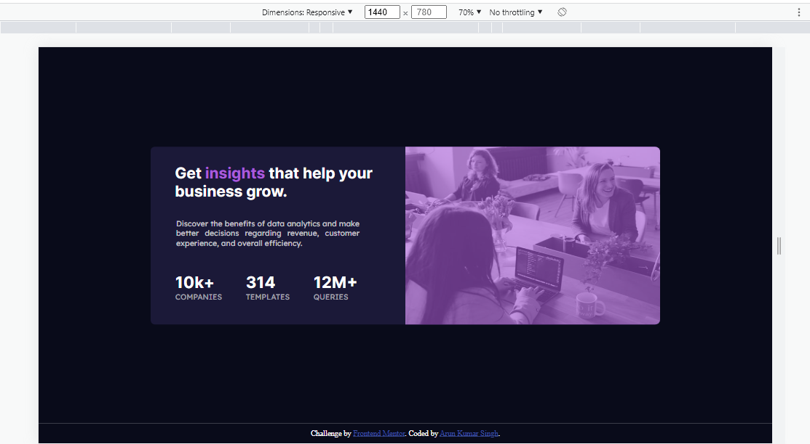
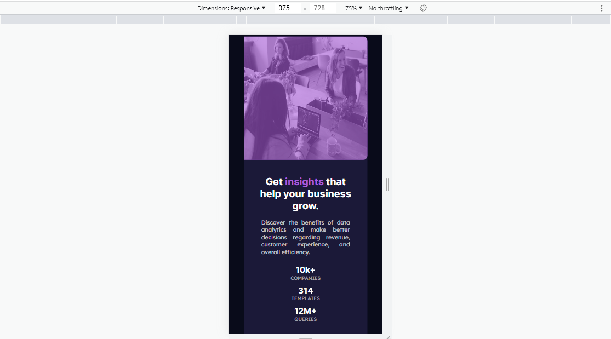

# FrontendMentorChallenge4
Frontend Mentor | Stats preview card component

## Table of contents

- [Overview](#overview)
  - [The challenge](#the-challenge)
  - [Screenshot](#screenshot)
  - [Links](#links)
- [My process](#my-process)
  - [Built with](#built-with)
  - [What I learned](#what-i-learned)
  - [Continued development](#continued-development)
- [Author](#author)

**Note: Delete this note and update the table of contents based on what sections you keep.**

## Overview

### The challenge

Users should be able to:

- View the optimal layout depending on their device's screen size

### Screenshot

### Links

- Solution URL: [Add solution URL here](https://your-solution-url.com)
- Live Site URL: [Add live site URL here](https://your-live-site-url.com)

## My process

### Built with

- Semantic HTML5 markup
- CSS custom properties
- Flexbox
- Media Queries

### What I learned
The major learning from this project was how we can efficiently use flex box properties along with media queries.

### Continued development

I want to work on css grid in my future projects.

## Author

- Website - [Arun kumar Singh](https://www.your-site.com)
- Frontend Mentor - [@arunsingh009](https://www.frontendmentor.io/profile/arunsingh009)
- Twitter - [@arunsingh641007](https://www.twitter.com/arunsingh641997)
